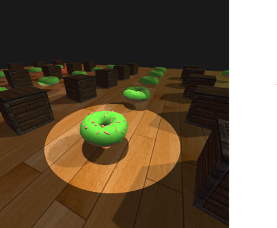

# Renderer
A simple 3D renderer made using OpenGL

## Screenshots

## Description

This is a small 3D renderer project I made over the course of around 2 months to learn OpenGL and gain an understanding of how rendering works.
I primarily followed the tutorials at [learnopengl.com](https://learnopengl.com), which was an amazing learning tool for OpenGL.
I managed to implement most of what I planned to, including a few things I didn't expect to like shadows.

## Compiling

1. Install [CMake](https://cmake.org/download) (3.28 or later)
2. Install dependencies: OpenGL, GLEW, GLFW3, GLM and assimp
3. Clone the repository: `git clone https://github.com/Draknol/Renderer`
4. Inside a build directory run: `cmake -B build -S .` (Change `SHADER_PATH` and `MODEL_PATH` if not running from project root)
5. To build: `cmake --build build --config release` (or `--config debug` for debug)
6. To run: `./renderer`

## Features

- Texturing with UV coordinates
- Vertex coloring
- Simple shaders
- GLSL shader file loading
- Texture loading (using stb_image.h)
- Model loading (using assimp)
- Blinn-Phong lighting
- Directional, point and spotlights
- Shadows
- PFC
- MSAA
- Multiple lights
- Instancing support
- 3D transformation with scaling, rotation, and translation
- Back face culling
- Support for EBOs
- FPS counter